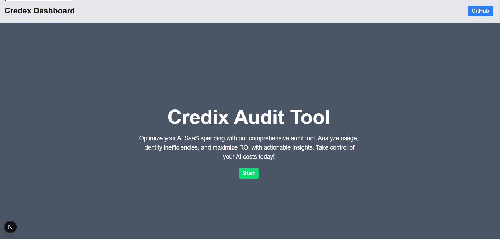
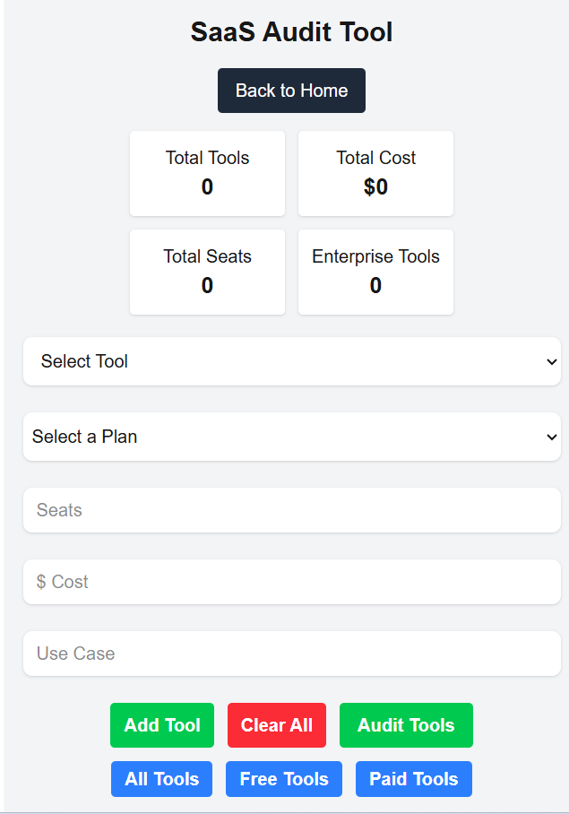
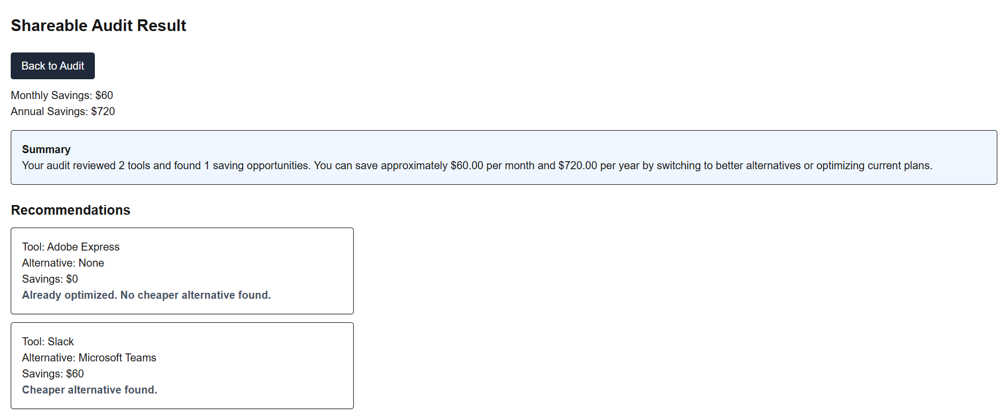
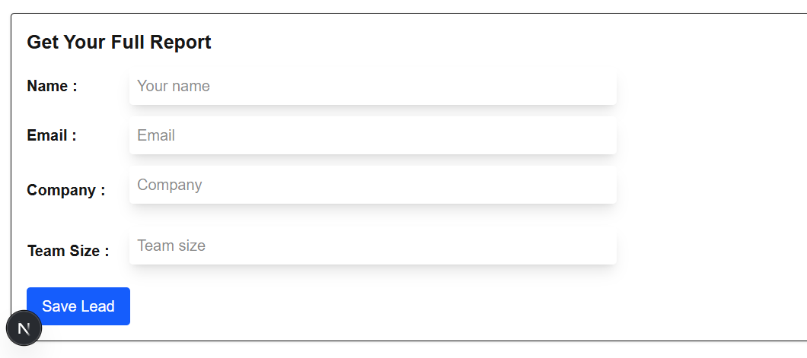

# SaaS Spend Optimizer

A full-stack web application that helps individuals and teams audit their SaaS subscriptions, identify overspending, and discover cheaper alternatives.

---

## Problem

Many users and startups subscribe to multiple SaaS tools without tracking:

- Duplicate tools
- Wrong pricing plans
- Overpaying for small teams
- Unused premium subscriptions

This leads to unnecessary monthly and yearly expenses.

---

## Solution

This application analyzes a user's SaaS stack and provides:

- Cost analysis
- Plan optimization suggestions
- Alternative tool recommendations
- Estimated monthly and yearly savings
- Shareable audit reports
- Lead capture for follow-up reports

---

## Features

### Core Features

✅ Add SaaS tools  
✅ Remove tools  
✅ Remove all tools  
✅ Search and filter tools  
✅ Audit tool stack  
✅ Monthly and yearly savings calculation  

### Smart Recommendations

✅ Detect duplicate tools  
✅ Suggest cheaper alternatives  
✅ Suggest better pricing plans  
✅ Flag already optimized tools  

### Backend Features

✅ Summary generation API  
✅ Audit results saved in database  
✅ Shareable audit result URLs  
✅ Lead capture form  

---

## Tech Stack

Frontend:

- Next.js
- React
- TypeScript
- Tailwind CSS

Backend:

- Next.js API Routes

## Database

This project uses :superbase as the backend database.

### Tables Used

#### 1. tools
Stores user-added SaaS tools.

Used for:
- Saving tool entries
- Removing tools
- Removing all tools

#### 2. audits
Stores generated audit reports.

Used for:
- Saving audit results
- Saving savings calculations
- Saving generated summaries
- Creating shareable audit URLs

#### 3. leads
Stores lead capture form submissions.

Used for:
- Name
- Email
- Company
- Team Size

This simulates real SaaS product lead generation.

-----------------

## Deployment

This project is deployed using :vercel
### Deployment Steps

1. Push project to GitHub
2. Import repository into Vercel
3. Add environment variables
4. Connect Supabase credentials
5. Deploy production build

### Environment Variables

```env
NEXT_PUBLIC_SUPABASE_URL=your_supabase_url
NEXT_PUBLIC_SUPABASE_ANON_KEY=your_supabase_anon_key
```

Production URL:

(Add your deployed link here after deployment)


## Project File Structure

```txt
app/
├── page.tsx                 → Landing page
├── audit/
│   ├── page.tsx             → Main audit form and audit flow
│   └── result/page.tsx      → Initial localStorage result page
│
├── auditRes/
│   └── [id]/page.tsx        → Shareable database-driven audit result page
│
├── api/
│   ├── summary/route.ts     → Backend summary generator
│   ├── leads/route.ts       → Saves lead form data
│   └── auditRes/route.ts    → Saves audit results

components/
├── ToolCard.tsx             → Displays added tools
├── LeadForm.tsx             → Lead capture form

lib/
├── audit.ts                 → Core audit business logic
├── supabase.ts              → Database connection

data/
├── pricing.ts               → Static SaaS pricing dataset
```

---

## Application Flow

```txt
Landing Page
↓
Audit Page
↓
Tool Analysis
↓
Summary Generation
↓
Save Audit in Database
↓
Shareable Result URL
↓
Lead Capture
```

---------------------

## Screenshots


### Landing Page



### Audit Page


### Sharable Audit Results



### Lead Capture Form



---------------------------------

## How to Run

Install dependencies:

```bash
npm install
```

Run project:

```bash
npm run dev
```

Open:

```txt
http://localhost:3000
```

---

## Future Improvements

- Real AI summaries using :Open AI API
- Live SaaS pricing APIs
- PDF audit exports
- Email report delivery
- Team analytics dashboard

---

## Author

Built by Hasmitha Marella